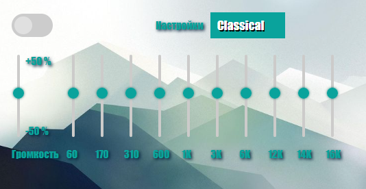

# EQ - Эквалайзер для браузера
Добро пожаловать в проект "EQ"! Это расширение позволяет пользователям настраивать звук в браузере с помощью простого и интуитивно понятного интерфейса.
## Описание
Наш эквалайзер предоставляет возможность управлять звуковыми частотами с помощью 10 ползунков, а также регулировать общую громкость с помощью отдельного ползунка. Кроме того, вы можете выбрать один из готовых пресетов для быстрого доступа к популярным настройкам звука.
## Установка и использование:

## Скриншот приложения:

